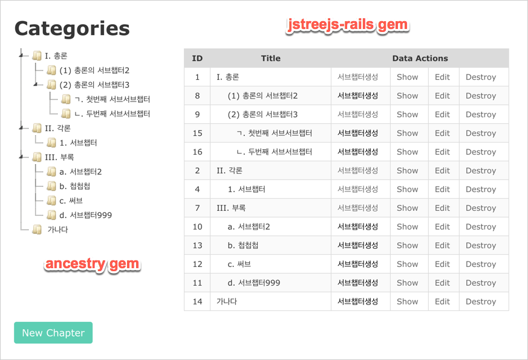

# Jstreejs::Rails

This gem was built for the asset pipeline of Ruby on Rails projects.

[](https://badge.fury.io/rb/jstreejs-rails)

## Installation

Add this line to your application's Gemfile:

```ruby
gem 'jquery-rails'
gem 'bulma-rails'
gem 'jstreejs-rails', '3.3.5.0'
gem 'ancestry'
```

And then execute:

```sh
$ bundle
```

## Usage

Scaffold `Category` resource.

```sh
$ rails g scaffold Category title description:text favorite_order 
$ rake db:migrate
```

Add `Ancestry` attribute to categories table.


```sh
$ rails g migration add_ancestry_to_categories ancestry:string:index 
$ rake db:migrate
```

**application.css**

```css
/*
 *= require bulma
 *= require jstree/default/style.min
 *= require jstree/default-dark/style.min
 *= require_tree .
 *= require_self
*/
```

or **application.scss**

```scss
@import 'bulma';
@import 'jstree/default/style.min';
@import 'jstree/default-dark/style.min';
```

**application.js**

```js
//= require jquery
//= require jquery_ujs
//= require jstree.min
//= require jstree_init
//= require turbolinks
//= require_tree .
```

**jstree_init.coffee**

```coffee
$(document).on 'dnd_stop.vakata', (e, data) ->
  ref = $('#tree').jstree(true)
  transfer_ids = data.data.nodes
  target_node = ref.get_node(event.toElement)
  target_node_id = if !target_node then "root" else target_node.id
  all_node_hash = data.data.origin._model.data
  transfer_nodes = []
  for node of all_node_hash
    transfer_nodes.push all_node_hash[node].id if transfer_ids.includes node
  console.log transfer_nodes.join(",")
  console.log target_node_id
  $.getScript("/categories/#{transfer_nodes.join(",")}/to/#{target_node_id}").done((script, textStatus) ->
    console.log textStatus
    console.log "transfered to #{target_node_id}"
    return
  ).fail (jqxhr, settings, exception) ->
    $('div.log').text 'Triggered ajaxError handler.'
    return

  return

$(document).on 'turbolinks:load', ->
  $('#tree').jstree 
    'core':
      'themes': 'name': 'default'
      "check_callback": true       
      'data':
        'url': '/categories.json'
        'data': (node) ->
          { 'id': node.id }
    'plugins': ['sort', 'types', 'dnd']     
    'sort': (a, b) ->
      a1 = @get_node(a)
      b1 = @get_node(b)
      if a1.icon == b1.icon
        if a1.order > b1.order then 1 else -1
      else
        if a1.icon > b1.icon then 1 else -1
  return 
```  

**category.rb**

```ruby
class Category < ApplicationRecord
  has_ancestry

  attr_accessor :parent_id

  default_scope { order('favorite_order, title collate "C"')}

  def self.transfer(transfer_ids, target_id)
    transfer_nodes = Category.find(transfer_ids.split(","))
    target_node = target_id == 'root' ? nil : Category.find(target_id)
    transfer_nodes.each do |category|
      category.update_attribute :parent, target_node
    end
  end    
end
```


**categories_controller.rb**

```rb
class CategoriesController < ApplicationController
  before_action :set_category, only: [:show, :edit, :update, :destroy]

  def index
    @categories = if request.xhr?
                    Category.all
                  else
                    Category.roots
                  end
  end

  def transfer
    Category.transfer(params[:transfer_ids], params[:target_id])
    @categories = Category.roots
    respond_to do |format|
      format.js
    end
  end  

  private
  ···
  def category_params
    params.require(:category).permit(:parent_id, :title, :description, :favorite_order)
  end   
```

**transfer.js.erb**

```erb
$("#categories_table_list").html("<%=j render @categories %>");
```

**_category.json.jbuilder** 

```js
json.id category.id
json.text "#{category.favorite_order} #{category.title}"
json.parent category.root? ? "#" : category.ancestry.split("/").last
json.order category.favorite_order
```

**index.html**

```erb
<div class="contaner">
  <div class="navbar">
    <h1 class='title is-3'>Categories</h1>
  </div>
  <div class="columns">
    <div class="column is-4">
      <div id="tree"></div>    
    </div>
    <div class="column is-8">
      <table class='table is-bordered is-striped is-hoverable is-fullwidth'>
        <thead>
          <tr class='has-background-grey-lighter'>
            <th class='has-text-centered'>ID</th>
            <th class='has-text-centered'>Title</th>
            <th class='has-text-centered' colspan="4">Data Actions</th>
          </tr>
        </thead>

        <tbody id="categories_table_list">
          <%= render @categories %>
        </tbody>
      </table>    
    </div>
  </div>
</div>

<br>

<%= link_to 'New Chapter', new_category_path, class: 'button is-primary' %>
```

**_category.html.erb**

```erb
<tr>
  <td class='has-text-centered'><%= category.id %></td>
  <td><%= indent(category.ancestry) %> <%= category.favorite_order %> <%= category.title %></td>
  <td><%= link_to '서브챕터생성', new_subcategory_path(category) %></td>
  <td><%= link_to 'Show', category %></td>
  <td><%= link_to 'Edit', edit_category_path(category) %></td>
  <td><%= link_to 'Destroy', category, method: :delete, data: { confirm: 'Are you sure?' } %></td>
</tr>
<%= render category.children %>
```





### Themes

Two themes were included by default: `default` and `default-dark`.

To change the theme from  `default` to `default-dark`, you should update two code lines as follows:

**application.css**

```css
 *= require jstree/default-dark/style.min
···
```

**jstree-init.coffee**

```coffee
$(document).on 'turbolinks:load', ->
  $('#tree').jstree 'core':
    'themes':
      'name': 'default-dark'
      ···
```

## Development

After checking out the repo, run `bin/setup` to install dependencies. You can also run `bin/console` for an interactive prompt that will allow you to experiment.

To install this gem onto your local machine, run `bundle exec rake install`. To release a new version, update the version number in `version.rb`, and then run `bundle exec rake release`, which will create a git tag for the version, push git commits and tags, and push the `.gem` file to [rubygems.org](https://rubygems.org).

## Contributing

Bug reports and pull requests are welcome on GitHub at https://github.com/luciuschoi/jstreejs-rails.
